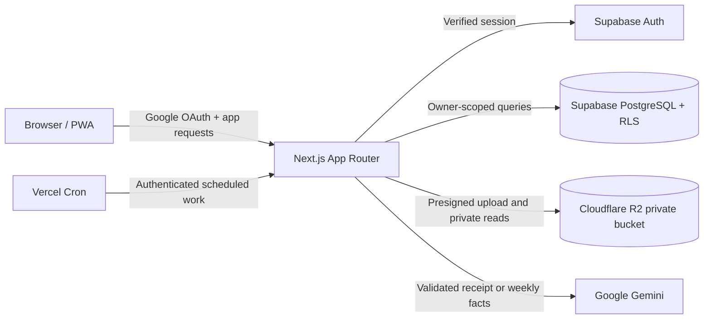

<div align="center">
  

  <p>
    A mobile-first personal expense tracker with private receipt storage,
    reviewable AI extraction, and transparent financial insights.
  </p>

  <p>
    <a href="https://fintrack-ai-sigma-two.vercel.app"><strong>Open live app</strong></a>
    ·
    <a href="#local-development">Run locally</a>
    ·
    <a href="#architecture">Architecture</a>
  </p>
</div>

## Overview

Fintrack AI is a full-stack Progressive Web App for recording and understanding
personal expenses. Transactions can be entered manually or created from a
receipt photo after the user reviews and corrects the AI-extracted fields.

The product follows a simple rule: **AI may assist, but the user remains in
control.** A receipt analysis never creates a transaction automatically. The
merchant, date, category, total, and line items remain editable until the user
confirms the result.

The current Phase 1 implementation is deployed as a non-commercial personal
project. It demonstrates end-to-end product engineering across responsive UI,
authentication, database authorization, private object storage, AI integration,
scheduled operations, exports, and account deletion.

## Highlights

- **Google authentication** with a shared sign-in and automatic registration
  flow through Supabase Auth.
- **Owner-scoped transaction management** with create, read, update, and delete
  operations protected by PostgreSQL Row Level Security.
- **Manual transaction entry** with server-side validation for amounts,
  categories, dates, notes, and identifiers.
- **Private receipt workflow** with browser-side image compression, short-lived
  R2 upload URLs, server-side file verification, and expiring previews.
- **Reviewable receipt AI** that extracts merchant, date, total, category, and
  line items through Gemini structured output before saving.
- **Dashboard and weekly insights** with Jakarta-aware date boundaries,
  category aggregation, recent transactions, and deterministic AI fallback.
- **CSV and XLSX exports** with UTF-8 support and spreadsheet formula-injection
  protection.
- **Durable account deletion** covering authentication, database records,
  private receipt objects, retries, and orphan reconciliation.
- **Installable PWA foundation** with a web app manifest, responsive navigation,
  service-worker asset caching, and a standalone offline fallback.

## Product principles

### Reviewable AI

Receipt content is treated as untrusted input. Gemini returns a strict data
shape that is validated again by the application, and every extracted field can
be corrected before a transaction exists.

### Privacy by boundary

Financial records are owner-scoped in both application queries and database
policies. Receipt images stay in a private R2 bucket and are accessed only with
short-lived signed operations.

### Resilient workflows

Provider failures do not remove the user's photo or draft. Manual entry remains
available, weekly insights have a deterministic fallback, and deletion jobs can
resume safely after interrupted provider calls.

### Mobile-first clarity

The interface follows the **Quiet Signal — Refined** design direction: calm,
precise, and intentionally restrained. Mobile and desktop layouts share the same
information hierarchy without turning the product into a dense admin dashboard.

## Architecture



The browser receives only publishable configuration. Supabase privileged keys,
R2 credentials, the Gemini API key, and the cron secret remain server-only.

## Technology stack

| Area                        | Technology                                    |
| --------------------------- | --------------------------------------------- |
| Application                 | Next.js 16 App Router, React 19, TypeScript 5 |
| Styling                     | Tailwind CSS 4, custom design tokens          |
| Authentication and database | Supabase Auth, PostgreSQL, Row Level Security |
| Receipt storage             | Cloudflare R2 through the AWS S3 SDK          |
| AI                          | Google Gen AI SDK with structured output      |
| Charts                      | Recharts                                      |
| Validation                  | Zod                                           |
| Exports                     | Native CSV generation, `write-excel-file`     |
| Testing                     | Vitest, PGlite, SQL assertions                |
| Hosting and scheduling      | Vercel, Vercel Cron                           |

## Security and data boundaries

- Google OAuth uses Supabase's PKCE flow and a dedicated callback route.
- Protected routes verify the authenticated account before rendering or
  mutating financial data.
- Browser requests cannot supply a trusted owner ID; it is derived from the
  verified server session.
- PostgreSQL RLS prevents cross-user access, while explicit owner filters add
  defense in depth.
- Receipt uploads accept supported image formats, normalize them to JPEG, and
  enforce a 500 KB application limit before private storage.
- R2 object keys are generated by the server under owner-scoped prefixes.
- Signed upload and preview URLs expire quickly and are never stored as
  transaction data.
- AI responses, form payloads, route parameters, and export text are validated
  or sanitized at their trust boundaries.
- Server credentials are validated from environment variables and never use a
  `NEXT_PUBLIC_*` prefix.
- Account deletion uses explicit confirmation, an idempotent cleanup request,
  retryable storage cleanup, and database cascades after verification.

## Local development

### Requirements

- Node.js 22 or newer
- npm 10.9 or newer
- A development Supabase project
- A private Cloudflare R2 bucket for receipt features
- A Google Gemini API key for AI features

### Setup

```powershell
git clone https://github.com/mariosianturi19/fintrack-ai.git
Set-Location -LiteralPath .\fintrack-ai
npm ci
Copy-Item -LiteralPath .env.example -Destination .env.local
```

Fill `.env.local` with development credentials. Keep real values out of source
control.

| Variable                               | Scope        | Purpose                                |
| -------------------------------------- | ------------ | -------------------------------------- |
| `NEXT_PUBLIC_APP_URL`                  | Browser-safe | Local or deployed application origin   |
| `NEXT_PUBLIC_SUPABASE_URL`             | Browser-safe | Supabase project URL                   |
| `NEXT_PUBLIC_SUPABASE_PUBLISHABLE_KEY` | Browser-safe | Supabase publishable key               |
| `SUPABASE_SECRET_KEY`                  | Server-only  | Privileged scheduled and deletion work |
| `R2_ACCOUNT_ID`                        | Server-only  | Cloudflare account identifier          |
| `R2_ENDPOINT`                          | Server-only  | R2 S3-compatible endpoint              |
| `R2_ACCESS_KEY_ID`                     | Server-only  | Scoped R2 access key ID                |
| `R2_SECRET_ACCESS_KEY`                 | Server-only  | Scoped R2 secret access key            |
| `R2_BUCKET_NAME`                       | Server-only  | Private receipt bucket                 |
| `GEMINI_API_KEY`                       | Server-only  | Receipt and insight generation         |
| `GEMINI_MODEL`                         | Server-only  | Configured Gemini model                |
| `CRON_SECRET`                          | Server-only  | Scheduled-route bearer authentication  |

Apply the SQL files in `supabase/migrations/` to the development Supabase
project in filename order, then configure Google OAuth and the R2 CORS policy
for the local application origin.

Start the development server:

```powershell
npm run dev
```

Open [http://localhost:3000](http://localhost:3000).

The service worker is enabled only in a production build. Use the following
commands when testing the installable or offline experience locally:

```powershell
npm run build
npm run start
```

## Quality checks

```powershell
npm run lint
npm run typecheck
npm test
npm run format:check
npm run build
```

The repository currently contains **183 automated tests across 18 test files**,
covering authentication boundaries, owner isolation, transactions, exports,
receipt storage and AI review, scheduled insights, environment validation, and
account deletion behavior. SQL verification under `supabase/tests/` complements
the TypeScript suite for schema and cross-user isolation checks.

## Repository structure

```text
fintrack-ai/
├── public/                    # Brand assets, PWA icons, and offline fallback
├── src/
│   ├── app/                   # App Router pages, layouts, actions, and API routes
│   ├── components/            # Shared UI, authentication, PWA, and app shell
│   ├── features/              # Dashboard, transactions, receipts, insights, deletion
│   ├── lib/                   # Auth, environment, navigation, and Supabase clients
│   └── styles/                # Design tokens
├── supabase/
│   ├── migrations/            # Reproducible database changes
│   └── tests/                 # SQL schema and RLS isolation checks
├── tests/                     # Vitest and PGlite test suite
├── design-proof/              # Design decisions and implementation handoff
├── DESIGN_SYSTEM.md           # Visual and interaction contract
├── PROGRESS.md                # Public milestone and verification status
└── project-brief-fintrack-ai.md # Product scope and engineering decisions
```

## Project status

- Phase 1 checkpoints F1-CP1 through F1-CP10 are implemented.
- A live deployment is available at
  [fintrack-ai-sigma-two.vercel.app](https://fintrack-ai-sigma-two.vercel.app).
- Automated linting, type checking, tests, formatting, and production builds are
  used as release gates.
- Focused production checks have covered authentication, transaction entry,
  dashboard aggregation, exports, and receipt analysis recovery.
- Extended physical-device PWA validation and limited-user validation remain
  ongoing; this repository does not claim broad public scale or an independent
  third-party security audit.

## Engineering references

- [Product brief](./project-brief-fintrack-ai.md)
- [Design system](./DESIGN_SYSTEM.md)
- [Project progress](./PROGRESS.md)
- [Database migrations](./supabase/migrations)
- [SQL verification](./supabase/tests)

## Author

Built by [Mario Sianturi](https://github.com/mariosianturi19) as a personal
Software Engineer (Full-Stack) portfolio project.
